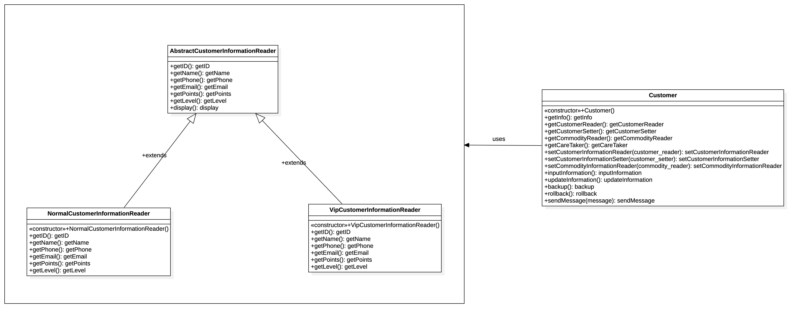
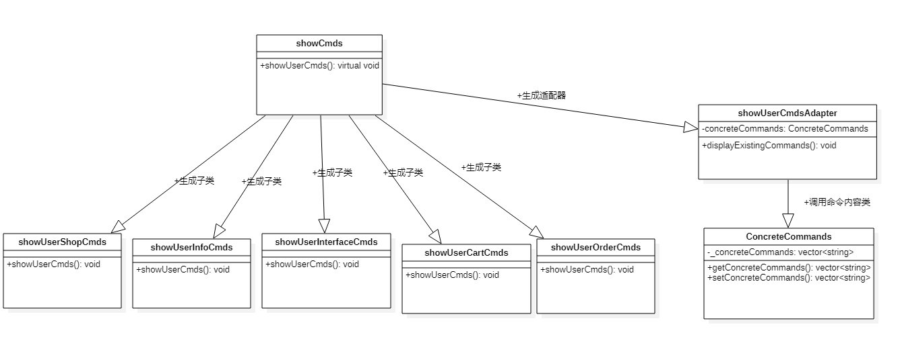

# 软件设计模式项目文档

[TOC]

## 1.总体介绍


### 1.1 组员构成

组长：1953617 李睿捷

成员：1950698 陆天宇

​			1952522 张峰

​			1852461 莫海洋

​			1953081 张福泰

​			1952815 余林旭

​			1953069 闫书玮

​			1953910 李林洲

​			1853629 席宇琛


### 1.2 项目概要

本项目选题为天猫购物节，运用C++的面向对象程序设计，运用23个核心设计模式以及课外学习的部分设计模式，模拟了从用户注册、登录、浏览店铺、浏览商品、浏览广告和活动、操作购物车、生成订单并支付等一系列的实际应用场景。


## 2.设计模式介绍

本部分将分别介绍所实现的子系统以及其中所运用到设计模式的详细信息。

#### 2.1 顾客子系统 Customer

#### 建造者模式

> 模式场景：在创建不同级别的复杂用户类型的代码中应用建造者模式

#### UML图


#### 设计

#### AbstractCustomerBuilder

​	定义了创建Customer对象的过程，提供了构建不同组成部分的接口。`setCustomerReader` `setCustomerSetter` `setCommodityReader`是对Customer对象不同部分的构建函数接口，由AbstractCustomerBuilder的派生类具体实现。

#### NullCustomerBuilder

​	具体实现了面向未登录用户的的构建接口的具体实现。

#### NormalCustomerBuilder

​	具体实现了面向普通用户的的构建接口的具体实现。

#### VipCustomerBuilder

​	具体实现了面向vip用户的的构建接口的具体实现。

#### CustomerDirector::makeCustomer

​	`CustomerDirector::makeCustomer`固定了各个组成部分的装配方式，具体怎样装配由AbstractCustomerBuilder的派生类实现。	

#### 代码实现

```c++
class AbstractCustomerBuilder{
public:
    virtual void setCustomerReader()=0;//构成CustomerReader的接口
    virtual void setCustomerSetter()=0;//构成CustomerSetter的接口
    virtual void setCommodityReader()=0;//构成CommodityReader的接口
    virtual Customer* getCustomer()=0;//返回Customer的接口
};
//面向未登录用户的的构建接口的具体实现
class NullCustomerBuilder:public AbstractCustomerBuilder{
private:
    Customer *_customer;
public:
    NullCustomerBuilder(){
        _customer=new Customer();
    };
    void setCustomerReader() override;
    void setCustomerSetter() override;
    void setCommodityReader() override;
    Customer* getCustomer() override;
};
//面向普通用户的的构建接口的具体实现
class NormalCustomerBuilder:public AbstractCustomerBuilder{
private:
    Customer *_customer;
public:
    NormalCustomerBuilder(){
        _customer=new Customer();
    };
    void setCustomerReader() override;
    void setCustomerSetter() override;
    void setCommodityReader() override;
    Customer* getCustomer() override;
};
//面向vip用户的的构建接口的具体实现
class VipCustomerBuilder:public AbstractCustomerBuilder{
private:
    Customer *_customer;
public:
    VipCustomerBuilder(){
        _customer=new Customer();
    };
    void setCustomerReader() override;
    void setCustomerSetter() override;
    void setCommodityReader() override;
    Customer* getCustomer() override;
};

class CustomerDirector{
public:
    //固定了各个组成部分的装配方式，具体怎样装配由AbstractCustomerBuilder的派生类实现
    static void makeCustomer(AbstractCustomerBuilder* builder){
        builder->setCommodityReader();
        builder->setCustomerReader();
        builder->setCustomerSetter();
    }
};
```

#### 观察者模式

> 模式场景：对双十一活动开始和结束进行监听的代码中应用观察者模式

#### UML图


#### 设计

#### AbstractEvent

​	定义了抽象的事件类和监听的接口，具体的监听事件由实体类实现。

#### DoubleEleven

​	抽象事件类的实体类，表示双十一活动的开始和结束事件，定义了监听者的vector容器 ，和表示监听情况的int类型value，当int值是偶数表示双十一的开始，奇数表示双十一结束，每次监听事件发生之后切换状态。

#### AbstractListener

​	监听者（观察者）的抽象类，定义了接收到监听信号之后的行为，具体实现行为由实体类实现。

#### CustomerListener

​	表示顾客客户端的监听，收到监听信号之后发送一条消息提醒消费者。

#### ShopListener

​	表示商店的监听，收到监听信号之后发送一条消息提醒消费者。

#### 代码实现

```c++
class AbstractListener;
class AbstractEvent {
public:
    virtual ~AbstractEvent()=default;
    virtual void addListener(AbstractListener* listener)=0;
    virtual void deleteListener(AbstractListener* listener)=0;
    virtual void notify()=0;
};

class DoubleEleven:public AbstractEvent{
public:
    void addListener(AbstractListener* listener);
    void deleteListener(AbstractListener* listener);
    void notify();
    ~DoubleEleven();
private:
    vector<AbstractListener*> listeners;
    int value=0;
};

class AbstractListener{
public:
    virtual void onNotify(int)=0;
};

class CustomerListener:public AbstractListener{
public:
    void onNotify(int value){
        if(value%2==0){
            cout<<"[系统]：双十一活动已经开始！！！开始选购吧"<<endl;
        }else{
            cout<<"[系统]：双十一活动即将结束！！！抓紧时间选购吧"<<endl;
        }
    }
};

class ShopListener:public AbstractListener{
public:
    void onNotify(int value){
        if(value%2==0){
            cout<<"[**店铺]：双十一活动已经开始！！！欢迎前来本店选购"<<endl;
        }else{
            cout<<"[**店铺]：双十一活动即将结束！！！不来本店看看嘛"<<endl;
        }
    }
};

```


#### 中介者模式

> 模式场景：实现一个所有人的聊天室，多个用户可以向聊天室发送消息，聊天室向所有用户显示消息。

#### UML图


#### 设计

​	将Customer之间的通信封装到一个类中单独处理，设计了Customer和ChatRoom，Customer用ChatRoom分享他们的消息。CustoemrInterface是演示类。

#### 代码实现

```c++
//Customer.h
//聊天室
class ChatRoom {
public:
    static void showMessage(Customer* customer,const string& message);
};

//Customer.cpp
//Customer发送消息
void Customer::sendMessage(const string &message) {
    ChatRoom::showMessage(this,message);
}
```


#### 备忘录模式

> 模式场景：用户的信息修改之后后悔，在回滚信息的的代码中应用备忘录模式

#### UML图


#### 设计

#### CustomerInformationOriginator

​	用于创建并在`CustomerInformationMemento`对象中存储状态。

#### CustomerInformationMemento

​	`CustomerInformationMemento`用于包含要被恢复的`CustomerInformation`的状态。

#### CustomerInformationCareTaker

​	`CustomerInformationCareTaker` 对象负责从 `CustomerInformationMemento `中恢复对象的状态。

#### 代码实现

```c++
//用户信息回退, Memento Pattern
class CustomerInformationMemento{
private:
    CustomerInformation* state;
public:
    explicit CustomerInformationMemento(CustomerInformation* state){
        this->state=state;
    }
    CustomerInformation* getState(){
        return state;
    }
};
class CustomerInformationOriginator{
private:
    CustomerInformation* _state;
public:
    void setState(CustomerInformation* state){
        this->_state=state;
    }
    CustomerInformation* getstate(){
        return _state;
    }
    CustomerInformationMemento* saveStateToMemento(){
        return new CustomerInformationMemento(_state);
    }
    void getStateFromMemento(CustomerInformationMemento* Memento){
        _state=Memento->getState();
    }
};
class CustomerInformationCareTaker{
private:
    stack<CustomerInformationMemento*> mementoList;
public:
    void add(CustomerInformationMemento* state){
        mementoList.push(state);
    }
    ~CustomerInformationCareTaker(){
        while(!mementoList.empty()){
            delete mementoList.top();
            mementoList.pop();
        }
    }
    CustomerInformationMemento* pop(){
        if(mementoList.size()>1){
            delete mementoList.top();
            mementoList.pop();
        }
        return mementoList.top();
    }
};

```


#### 模板模式

> 模式场景：用户信息的阅读器，整体的显示的顺序是固定的，可以应用模板模式

#### UML图



#### 设计

​	创建AbstractCustomerInformationReader抽象类，模板方法为display()，NormalCustomerInformationReader和VipCustomerInformationReader拓展了AbstractCustoemrInformationReader的实体类，重写了抽象类的方法。

#### 代码实现


#### 单例模式

> 模式场景：多用户登录管理每个应用程序只有一个，可以应用单例模式

#### UML图


#### 设计

​	创建CustomerSet类。CustomerSet类有它的私有构造函数和本身的一个静态实例。CustomerSet类提供了一个静态方法，供外界获取它的静态实例。

#### 代码实现

```c++
class CustomerSet{
private:
    vector<Customer*> _customers;
    int _index;
    static CustomerSet* _instance;
    CustomerSet(){};
public:
    static CustomerSet* getInstance(){
        if(_instance==nullptr)
            _instance=new CustomerSet;
        return _instance;
    }
    void init();
    void addCustomer(Customer* customer);
    void deleteCustomer();
    bool switchCustomer(int index);
    Customer* getCustomer();
    vector<Customer*> getCustomers();
};
```


### 2.2 店铺子系统 Shop

#### 2.2.1 子系统的作用与功能
1. 浏览所有店铺概要信息
2. 对店铺进行评价
3. 根据评分筛选店铺
4. 查看店铺的详细信息
5. 查看所有店铺、指定店铺的商品列表

#### 2.2.2 设计模式详述
##### 抽象工厂模式 (Abstract Factory)

##### 工厂模式 (Factory) 

##### 空项目模式(Null Object) 

##### 模板方法(Template Method)

##### 类图


##### 详述

模板方法：`accept()`函数被声明为虚函数，根据基类所派生的子类的不同情况和访问者模式所派生的不同子类，决定具体该怎么执行。

抽象工厂模式：`AbstractFactory`为各个Factory的生产工厂，即由该抽象工厂先生产对应的工厂，后续再由各工厂生产其所对应的产品。其中生产`Shop`的工厂的`shopFactory`的函数`createShop()`对应声明为虚函数，以供工厂后续实际使用时重新定义和具体实现。

工厂模式：实例化一个`shopFactory`工厂，调用工厂中的`createShop()`函数，该函数会根据用户所提供的类型`type`返回一个店铺。

空对象模式：紧接上文，如果用户所提供的类型为`null`的话，一般的处理方法是输出一条错误信息然后返回空指针或空对象。但空对象模式支持用户未输入参数或输入参数为`null`类型的情况下仍然正确生成对象，符合OCP原则的同时增强了程序的工作能力和健壮性。

##### 实现接口与核心代码

```c++
Shop *ShopFactory::createShop(string type) {
    if (type == "")
        return new nullShop("unknown", 0, "unknown", "2021-01-01", 0, 0, list<ShopRemark *>(),
                            map<CommodityInformation *, int>());

    else if (type == "food")
        return new foodShop("newFoodshop", 1, "food", "2021-01-01", 0, 0, list<ShopRemark *>(),
                            map<CommodityInformation *, int>());

    else if (type == "drink")
        return new drinkShop("newDrinkshop", 2, "drink", "2021-01-01", 0, 0, list<ShopRemark *>(),
                             map<CommodityInformation *, int>());

    else if (type == "digital")
        return new digitalShop("newDigitalshop", 3, "digital", "2021-01-01", 0, 0, list<ShopRemark *>(),
                               map<CommodityInformation *, int>());

    else if (type == "book")
        return new bookShop("newBookshop", 4, "book", "2021-01-01", 0, 0, list<ShopRemark *>(),
                            map<CommodityInformation *, int>());

    else if (type == "daily")
        return new dailyShop("newDailyshop", 5, "daily", "2021-01-01", 0, 0, list<ShopRemark *>(),
                             map<CommodityInformation *, int>());

    else if (type == "furniture")
        return new furnitureShop("newfurnitureshop", 6, "furniture", "2021-01-01", 0, 0, list<ShopRemark *>(),
                                 map<CommodityInformation *, int>());

    else if (type == "clothes")
        return new clothesShop("newClothesshop", 7, "clothes", "2021-01-01", 0, 0, list<ShopRemark *>(),
                               map<CommodityInformation *, int>());

    else if (type == "stationery")
        return new stationeryShop("newStationeryshop", 8, "stationery", "2021-01-01", 0, 0, list<ShopRemark *>(),
                                  map<CommodityInformation *, int>());

    else if (type == "sport")
        return new sportShop("newSportshop", 9, "sport", "2021-01-01", 0, 0, list<ShopRemark *>(),
                             map<CommodityInformation *, int>());

    return nullptr;
}
```


##### 访问者模式(Visitor Mode)

##### 类图


##### 详述

`Visitor`作为访问者模式的基类，声明了纯虚函数`visit()`用来具体执行`Shop`类中展示对应信息的函数。

派生类`infoVisitor`会调用`visit()`来调用`Shop`中`showShopInformation()`函数以展示店铺的详细信息。

派生类`filterVisitor`会调用`visit()`来调用`Shop`中`showShopInformation()`函数以展示利用过滤器模式筛选之后店铺的详细信息。

##### 核心代码

```c++
class Visitor {
public:
    virtual void visit(Shop *shop) = 0;
};

class infoVisitor : public Visitor {
public:
    void visit(Shop *shop) {
        shop->showShopInformation();
    }
};

class filterVisitor : public Visitor {
public:
    void visit(Shop *shop) {
        cout << shop->getShopId() << " - 店铺名称: " << shop->getShopName() << endl;
    }
};
```


##### 过滤器模式 (Filter Mode)

##### 类图


##### 详述

`ShopFilter`是店铺过滤器模式的基类，里面定义了根据相应标准过滤店铺的选择标准（店铺评分），符合对应标准的店铺会根据店铺评分被过滤到相应的过滤器`HighShopFilter`,`MidShopFilter`,`LowShopFilter`中，以此实现同一属性不同值的店铺的分离。

##### 核心代码

```c++
class ShopFilter {
public:
    //Define as an abstract class and functions.
    virtual list<Shop *> selectShop(list<Shop *> ShopList) = 0;
};

class HighShopFilter:public ShopFilter{
public:
    list<Shop *> selectShop(list<Shop *> ShopList);
};

class MidShopFilter:public ShopFilter{
public:
    list<Shop *> selectShop(list<Shop *> ShopList);
};

class LowShopFilter:public ShopFilter{
public:
    list<Shop *> selectShop(list<Shop *> ShopList);
};
```


```c++
list<Shop *> HighShopFilter::selectShop(list<Shop *> ShopList) {
    list<Shop *> HighShopList;
    for (auto shop:ShopList) {
        if (shop->getTotalRemarkScore() >= 7.50)
            HighShopList.push_back(shop);
    }
    return HighShopList;
}

list<Shop *> MidShopFilter::selectShop(list<Shop *> ShopList) {
    list<Shop *> MidShopList;
    for (auto shop:ShopList) {
        if (shop->getTotalRemarkScore() >= 5.00 && shop->getTotalRemarkScore() < 7.50)
            MidShopList.push_back(shop);
    }
    return MidShopList;
}

list<Shop *> LowShopFilter::selectShop(list<Shop *> ShopList) {
    list<Shop *> LowShopList;
    for (auto shop:ShopList) {
        if (shop->getTotalRemarkScore() >= 2.50 && shop->getTotalRemarkScore() < 5.00)
            LowShopList.push_back(shop);
    }
    return LowShopList;
}
```


##### 代理模式 Proxy

##### 类图


##### 详述

类`proxyShop`是店铺类`Shop`的一个子类，但是其中包含了一个`Shop`类型的对象，这正是代理模式的核心所在：代理对象与被代理对象属于同一个基类之下的派生子类，但是代理对象的声明中要包含被代理对象，这样，对代理对象的操作就可以转接到对被代理对象的操作，而非直接对被代理对象进行操作。在本子系统中，即通过`proxyShop`中的函数可以对上述其他9种`Shop`进行操作，实现代理功能。

##### 核心代码

```c++
class proxyShop:public Shop{
private:
    Shop *shop;
public:
    void accept(Visitor &v);

    proxyShop(const string &shopName, int shopId, const string &shopType, const string &shopDate, int shopStorage,
              double shopScore, const list<ShopRemark *> &shopRemarks, const map<CommodityInformation *, int> &itemList,
              Shop *shop);

    void display();
};
void proxyShop::accept(Visitor &v) {
    return v.visit(this);
}

proxyShop::proxyShop(const string &shopName, int shopId, const string &shopType, const string &shopDate,
                     int shopStorage, double shopScore, const list<ShopRemark *> &shopRemarks,
                     const map<CommodityInformation *, int> &itemList, Shop *shop) : Shop(shopName, shopId, shopType,
                                                                                          shopDate, shopStorage,
                                                                                          shopScore, shopRemarks,
                                                                                          itemList), shop(shop) {}


void proxyShop::display() {
    // 创建代理对象
    if (shop == nullptr) {
        shop = new nullShop("unknown", rand() % 10000 + 10, "unknown", "2021-01-01", 0, 0, list<ShopRemark *>(),
                            map<CommodityInformation *, int>());
    }
    shop->showShopInformation();
}
```


##### 适配器模式 ( Adapter )

##### 类图



##### 详述

在实现与用户交互界面的过程中，为了使代码更加简洁整齐以及使输出命令的语句可复用，子系统`Basic`其中的命令类`showCmds`专门用来实现与用户交互时所用到的命令和提示语句。其中虚函数`showUserCmds()`会根据实际上每个派生的命令类使所具体输出的语句各自不同。为了更方便地管理这些命令类，可以使用适配器模式。因为基类中没有对应功能的函数，而承载用户命令内容的类与命令类又不是同一种类，所以适配器模式可以很方便地将这两种类连接在一起。

首先使用类`ConcreteCommands()`读取已经存在的用户命令类中的内容；然后创建命令类的派生子类适配器`showUserCmdsAdapter`。调用其中的函数`displayExistingCommands()`即可读取到具体的内容。

##### 核心代码

```c++
class ConcreteCommands {
private:
    vector<string> _concreteCommands;
public:
    const vector<string> &getConcreteCommands() const {return _concreteCommands;}

    void setConcreteCommands(const vector<string> &concreteCommands) {_concreteCommands = concreteCommands;}
};
/*
 * 设计模式 - 适配器模式 Adapter Mode
 * 使用适配器模式可以在派生类中融入外部的其他对象和增加基类中没有的功能
 * 本适配器中，融入了外部一个包含所有命令集合的类，以及输出它们的新函数（基类没有）
 * 增强了类和对象的功能性。
 */
class showUserCmdsAdapter : public showCmds {
private:
    ConcreteCommands concreteCommands;
public:
    void displayExistingCommands();
};

```

##### 装饰器模式

##### 类图


##### 详述

装饰器模式允许向一个现有的对象添加新的功能，同时又不改变其结构。这种类型的设计模式属于结构型模式，它是作为现有的类的一个包装。

这种模式创建了一个装饰类，用来包装原有的类，并在保持类方法签名完整性的前提下，提供了额外的功能。

`shopDecorator`作为店铺装饰器模式的基类，`AddStarShopDecorator`是在其基础上派生出的子类，其中`execute()`函数用来将某个特定店铺的评分置为10分。通过该装饰器以及其中的函数，可以实现基类中没有定义的修改店铺评分为10分的功能。

##### 核心代码

```c++
class shopDecorator : public Shop {
protected:
    Shop *decoratedShop;
public:
    virtual void accept(Visitor &v);

    shopDecorator(const string &shopName, int shopId, const string &shopType, const string &shopDate, int shopStorage,
                  double shopScore, const list<ShopRemark *> &shopRemarks,
                  const map<CommodityInformation *, int> &itemList, Shop *decoratedShop);
};

class AddStarShopDecorator : public shopDecorator {
public:

    void accept(Visitor &v);

    void execute() {
        decoratedShop->setRemarkScore(10.00);
    }

    AddStarShopDecorator(const string &shopName, int shopId, const string &shopType, const string &shopDate,
                         int shopStorage, double shopScore, const list<ShopRemark *> &shopRemarks,
                         const map<CommodityInformation *, int> &itemList, Shop *decoratedShop);
};
shopDecorator::shopDecorator(const string &shopName, int shopId, const string &shopType, const string &shopDate,
                             int shopStorage, double shopScore, const list<ShopRemark *> &shopRemarks,
                             const map<CommodityInformation *, int> &itemList, Shop *decoratedShop) : Shop(shopName,
                                                                                                           shopId,
                                                                                                           shopType,
                                                                                                           shopDate,
                                                                                                           shopStorage,
                                                                                                           shopScore,
                                                                                                           shopRemarks,
                                                                                                           itemList),
                                                                                                      decoratedShop(
                                                                                                              decoratedShop) {}

void shopDecorator::accept(Visitor &v) {
    return v.visit(this);
}

AddStarShopDecorator::AddStarShopDecorator(const string &shopName, int shopId, const string &shopType,
                                           const string &shopDate, int shopStorage, double shopScore,
                                           const list<ShopRemark *> &shopRemarks,
                                           const map<CommodityInformation *, int> &itemList, Shop *decoratedShop)
                                           : shopDecorator(shopName, shopId, shopType, shopDate, shopStorage, shopScore, shopRemarks, itemList,
                                                           decoratedShop) {}

void AddStarShopDecorator::accept(Visitor &v) {
    setRemarkScore(10.00);
    //return v.visit(this);
}

```


##### 责任链模式 Chain Of Responsibility

##### 类图


##### 详述

责任链模式为请求创建了一个接收者对象的链。这种模式给予请求的类型，对请求的发送者和接收者进行解耦。这种类型的设计模式属于行为型模式。如果请求在本级责任链中无权执行，则传递到下一级责任节点进行判断。

责任链模式作为日志系统，在主界面内每个函数都执行完毕时均可以输出对应的信息。等级责任链按照等级1-2-3 正常-成功-失败来安排，逻辑为：如果为1则正常，不为1传递请求到下一级责任节点判断是否为2，如果为2则成功，不为2传递请求到下一级责任节点则判断是否为3，如果为3则为失败，并输出对应的日志语句。

##### 核心代码

```c++
class AbstractLogger {
protected:
    AbstractLogger *_nextLogger;
public:
    AbstractLogger() { _nextLogger = nullptr; }

    virtual ~AbstractLogger() {}

    void SetNextLogger(AbstractLogger *logger) { _nextLogger = logger;}

    virtual void writeLog(int level) = 0;
};

class NormalLogger : public AbstractLogger {
    virtual void writeLog(int level);
};

class ErrorLogger : public AbstractLogger {
    virtual void writeLog(int level);
};

class SuccessLogger : public AbstractLogger {
    virtual void writeLog(int level);
};
void NormalLogger::writeLog(int level) {
    if (level == 1)
        cout << "日志: 目前系统正常运行。" << endl;
    else
        _nextLogger->writeLog(level);
}

void SuccessLogger::writeLog(int level) {
    if (level == 2)
        cout << "系统日志: 用户操作成功。" << endl;
    else
        _nextLogger->writeLog(level);
}

void ErrorLogger::writeLog(int level) {
    if (level == 3)
        cout << "系统日志: 用户输入命令错误。" << endl;
    else
        _nextLogger->writeLog(level);
}
```


##### 原型模式 Prototype

##### 类图


##### 详述

是用于创建重复的对象，同时又能保证性能。这种类型的设计模式属于创建型模式，它提供了一种创建对象的最佳方式。

这种模式是实现了一个原型接口，该接口用于创建当前对象的克隆。当直接创建对象的代价比较大时，则采用这种模式。例如，一个对象需要在一个高代价的数据库操作之后被创建。我们可以缓存该对象，在下一个请求时返回它的克隆，在需要的时候更新数据库，以此来减少数据库调用。

在本项目中，初始化商店用到了原型模式。因为商店是将预先创建好的商店加入原型类中的数据缓存库，然后根据ID查找对应已经存在的商店，如果商店在数据缓存库已经有的话，直接利用已经实现的克隆函数快速完成拷贝克隆即可。

##### 核心代码

```c++
/*
 * 原型模式 Prototype
 */
class shopCache{
private:
    map<Shop*,int> _shopMap; //原型模式所需的商店缓存数据池
public:
    Shop* cloneShop(int shopID);//获取数据池中所缓存的店铺
    void loadCache();// 预先设置缓存的函数
};
/*
 * 设计模式：原型模式 Prototype
 * 因为商店是初始化的，不需要大规模、频繁的变化，所以可以使用原型模式以完成浅拷贝
 * 现在原型模式自带的商店缓存中加入所有的已有商店，然后在实际初始化的时候直接使用已有的商店即可。
 * 确保已有的商店都是可以找到的，找不到返回空指针nullptr即可。
 */
void shopCache::loadCache() {
    ShopRemark *defaultRemark = new ShopRemark("2021-01-01", "Administrator", "Good.", 5);
    list<ShopRemark *> defaultRemarkList;
    defaultRemarkList.push_back(defaultRemark);
    map<CommodityInformation *, int> defaultGoodsList;
    Shop *shop1 = new foodShop("芜湖肉蛋葱鸡专营店", 1, "food", "2013-09-18", 0, 0, defaultRemarkList, defaultGoodsList);
    _shopMap[shop1] = 1;
    Shop *shop2 = new drinkShop("芜湖美汁汁儿专营店", 2, "drink", "2013-09-18", 0, 0, defaultRemarkList, defaultGoodsList);
    _shopMap[shop2] = 2;
    Shop *shop3 = new digitalShop("芜湖外设专营店", 3, "digital", "2013-09-18", 0, 0, defaultRemarkList, defaultGoodsList);
    _shopMap[shop3] = 3;
    Shop *shop4 = new bookShop("芜湖杀人书专营店", 4, "book", "2013-09-18", 0, 0, defaultRemarkList, defaultGoodsList);
    _shopMap[shop4] = 4;
    Shop *shop5 = new dailyShop("芜湖日用品专营店", 5, "daily", "2013-09-18", 0, 0, defaultRemarkList, defaultGoodsList);
    _shopMap[shop5] = 5;
    Shop *shop6 = new furnitureShop("芜湖厨具专营店", 6, "furniture", "2013-09-18", 0, 0, defaultRemarkList, defaultGoodsList);
    _shopMap[shop6] = 6;
    Shop *shop7 = new clothesShop("芜湖发病棉袄专营店", 7, "clothes", "2004-12-01", 0, 0, defaultRemarkList, defaultGoodsList);
    _shopMap[shop7] = 7;
    Shop *shop8 = new stationeryShop("芜湖文具专营店", 8, "stationery", "2013-09-18", 0, 0, defaultRemarkList,
                                     defaultGoodsList);
    _shopMap[shop8] = 8;
    Shop *shop9 = new sportShop("芜湖运动设备专营店", 9, "sport", "2013-09-18", 0, 0, defaultRemarkList, defaultGoodsList);
    _shopMap[shop9] = 9;
    Shop *shop0 = new nullShop("芜湖空商店", 0, "", "", 0, 0, defaultRemarkList, defaultGoodsList);
    _shopMap[shop0] = 0;
    Shop *shop10 = new AddStarShopDecorator("芜湖装饰器高分空商店", 10, "", "", 0, 10, defaultRemarkList, defaultGoodsList,
                                            new nullShop("", 0, "", "", 0, 0, defaultRemarkList, defaultGoodsList));
    _shopMap[shop10] = 10;
}

// 原型模式的寻找商店
Shop *shopCache::cloneShop(int shopID) {
    for (auto _map:_shopMap) {
        if (_map.second == shopID)
            return _map.first;
    }
    return nullptr;
}
```


### 2.3 商品 Commodity

#### 桥接模式（Bridge）


##### 详述

在商品子系统中，获得商品信息的功能使用了桥接模式，使得商品类的具体实现与其抽象功能分离，二者可以互不干扰地独立变化。

`CommodityInformation`是商品具体实现的基类，它只含有一些最基本的商品信息，比如商品名称，商品ID等。`SingleCommodity`是商品信息基类的一个实现，表示普通的单件商品，它有其特有的属性`amount`即库存。`CompositeCommodity`是商品信息基类的另一个实现，表示复合商品，他也有特有属性`commodity_list`来存储其复合了哪些其他商品。

`CommodityInformationReader`是获取商品属性这一抽象功能的基类，它只有一些基本的方法函数，比如获取商品名称，获取商品价格等。`CommodityInformationVipReader`继承于这个基类，它针对于VIP用户，其`getPrice()`这个方法获取的商品价格是原价的八折。

商品实体基类可以派生出多种复杂的商品具体实现，而商品功能基类也可以派生出多样的方法，两边仅通过基类之间的友元关系“桥接”在一起，使得两种类型的类可被结构化改变而互不影响。

##### 实现API

- `CommodityInformationReader::getPrice():int`，获得商品价格。
- `CommodityInformationReader::getName():string`，获得商品名称。
- `CommodityInformationReader::getID():int`，获得商品ID。
- `CommodityInformationReader::getType():string`，获得商品类型。
- `CommodityInformationReader::getShop():Shop*`，获得商品的商铺。
- `CommodityInformationVipReader::getPrice():int`，VIP用户获得商品价格（打八折）。
- `CommodityInformationVipReader::getName():string`，VIP用户获得商品名称。
- `CommodityInformationVipReader::getID():int`，VIP用户获得商品ID。
- `CommodityInformationVipReader::getType():string`，VIP用户获得商品类型。
- `CommodityInformationVipReader::getShop():Shop*`，VIP用户获得商品的商铺。

#### 组合模式（Composite）

##### 类图


##### 详述

组合模式用于把一组相似的对象当作一个单一的对象，依据树形结构来组合对象，用来表示部分以及整体层次。

`CommodityInformation`是商品基类，派生出来`SingleCommodity`单一商品类以及`CompositeCommodity`组合商品类。单一商品类特有属性`amount`表示库存，复合商品类特有属性`commodity_list`存储指向商品基类的指针。商品基类既作为所有商品的统一接口，也作为聚合的对象存在于复合商品类的属性中，从而实现组合模式。

##### 实现API

- `CommodityInfomationSetter::setName(string):void`，设置商品名称。
- `CommodityInfomationSetter::setID(int):void`，设置商品ID。
- `CommodityInfomationSetter::setType(string):void`，设置商品类型。
- `CommodityInfomationSetter::setPrice(int):void`，设置商品价格。
- `CommodityInfomationSetter::addCommodity(CommodityInformation*):bool`，向组合商品中添加商品，如果调用者为单一商品类，则返回`false`。
- `CommodityInfomationSetter::removeCommodity(CommodityInformation*):bool`，删除组合商品中的某件商品，如果调用者为单一商品类，则返回`false`。

#### 迭代器模式（Iterator）

##### 类图


##### 详述

`CompositeCommodityIterator`复合商品迭代器继承于STL中的`iterator<iterator_tag, T>`虚基类，重载了赋值、自加、等于等操作符，使得编写代码时可以轻易使用迭代器遍历复合商品中的所有商品。

##### 实现API

- `CompositeCommodityIterator::opteraor=(CompositeCommodityIterator&)`，迭代器赋值。
- `CompositeCommodityIterator::opteraor==(CompositeCommodityIterator&)`，迭代器等于判断。
- `CompositeCommodityIterator::opteraor!=(CompositeCommodityIterator&)`，迭代器不等于判断。
- `CompositeCommodityIterator::operator++()`，迭代器自加。
- `CompositeCommodityIterator::operator*()`，迭代器取值。
- `CompositeCommodity::begin()`，获取复合商品的第一个元素的迭代器。
- `CompositeCommodity::end()`，获取复合商品的最后一个元素的迭代器。

#### 享元模式（Flyweight）

##### 类图


##### 关键代码

```c++
/*
 * Flyweight设计模式
 *      工厂在生成对象的时候优先检查哈希表里有没有，有的话直接调用该对象，没有的话再重新生成。
 *      可以大大减少内存的使用，提高运行效率。
 */
CommodityInformation * CommodityFactory::getSingleCommodity(int ID, string name, int price, int shopID, int amount) {
    for (auto iter:_existingCommodityList) {
        reader.setCommodityInformation(iter.first);
        if (reader.getID() == ID)
            return iter.first;
        else
            continue;
    }
    SingleCommodity *singleCommodity = new SingleCommodity(ID, name, price, shopID, amount);
    _existingCommodityList[singleCommodity]++;
    return singleCommodity;
}
```

##### 详述

在`CommodityFactory`商品工厂类中添加属性`_existingCommodityList`，它保存了所有商品的指针以及对应的商品ID，数据结构使用了`std::map`，它的查找时间复杂度为$log{n}$，提高运行效率。在每次构造商品之前，首先遍历`_existingCommodityList`，如果需要构造的商品ID已经存在，则直接返回这个已经存在的商品，不存在的情况下才调用构造函数生成`SingleCommodity`单件商品。从而减少应用的空间使用。

##### 实现API

`getSingleCommodity(int ID, string name, int price, int shopID, int amount):CommodityInformation*`，构造新商品。

#### 命令模式（Command）

##### 类图


##### 详述

`Command`为命令的虚基类，成员为一个`execute()`纯虚函数。`CommoditySale`类具体功能是卖出一定数量的某件商品。它承并实现了`Command`类，并且聚合了`CommodityInformation`类，表示这个命令类控制的哪件商品。


复合商品售卖流程：`CommoditySale`命令类调用`CommodityInformation`商品基类的虚函数`Sell()`，这个函数在复合商品类`CompositeCommodity`复合商品类中实现，它使用迭代器依次调用`SingleCommodity`单件商品类的`IfEnough()`方法，如果所有单件商品的库存都充足，则调用`Sale()`方法依次将商品卖出，并返回`true`，否则返回`false`。

##### 实现API

- `CommoditySale::execute()`，商品售卖命令。
- `CommodityDisplay::execute()`，商品展示命令（复合商品会依次展示其中包含的单件商品）。

### 2.4 活动与广告 Activity & Advertisement
####	1. 功能与实现

##### 广告子系统

+ 主要功能：

  1. 添加广告
  2. 浏览广告

+ 实现方案：

  1. 结构体AdNode代表的变量类型用于存储一个广告的具体内容，包括广告ID以及广告内容。

     ```
     struct AdNode//广告
     {
         int AdID;
         string Content;
     
         AdNode(int ID, string Cont)
         {
             AdID = ID;
             Content = Cont;
         }
     };
     ```

     

  2. AdvertisingSystem类用于对所有当前存在的广告进行管理，是广告系统的主体，通过开放Accept函数使用Visitor模式进行功能实现与扩展。为了保持广告系统的唯一性，使用了单例模式。

     ```
     class AdvertisingSystem//广告子系统（单例）
     {
     public:
         ~AdvertisingSystem();
     
         static AdvertisingSystem* GetAdSystemInstance();
     
         void Accept(AdVisitor* Visitor);
     
         void PrintAd(int Index);//打印广告
     
     private:
     
         AdvertisingSystem();
     
         static AdvertisingSystem* AdSystemInstance;
     
         vector<AdNode*> AdvertisingList;
     };
     ```

  3. AdVisitor类作为AdvertisingSystem的访问者，用于实现与扩展广告系统的功能，并保持AdvertisingSystem类的简洁性。AdVisitor_Browse类与AdVisitor_Add类均继承于AdVisitor类，分别实现了广告系统的浏览功能和添加功能。

     ```
     class AdVisitor//广告visitor父类
     {
     public:
     
         virtual ~AdVisitor() = default;
     
         virtual void Visit(AdvertisingSystem* AdSystem) = 0;
     };
     class AdVisitor_Browse : public AdVisitor//浏览广告visitor子类
     class AdVisitor_Add : public AdVisitor//添加广告visitor子类
     ```

##### 活动子系统

+ 主要功能：

  1. 添加活动
  2. 浏览活动
  3. 计算活动价格并选择最优方案
  4. 根据商品推荐相关活动

+ 实现方案：

  1. AcNode类是单个活动的基类，用于存储所有活动都拥有的内容，包括活动ID以及活动内容。

     ```
     class AcNode//活动父类
     {
     public:
     
         AcNode(int ID, string Cont);//两类活动id不可相同
         
         int AcID;
         string Content;
     };
     ```

     从AcNode类派生出两个子类：AcNode_Discount、AcNode_FullReduction，分别代表打折类活动和满减类活动。

     AcNode_Discount中存储了打折商品列表以及打折力度这两个关键属性，AcNode_FullReduction中存储了满减的阈值以及力度这两个关键属性。

     通过这些关键属性便可以提供：1.是否能使用该活动；2.使用该活动的价格为多少，这两个函数，进一步便可以提供完整的“ ExecuteActivity”这个函数用于获取通过该活动的价格。

     ```
     class AcNode_Discount : public AcNode//打折类活动子类
     {
     public:
     
         AcNode_Discount(int ID, string Cont, vector<int>& CommodityInformationIDList, float DisRate);
         
         float ExecuteActivity(CommodityInformation* BuyCommodityInformation, int Amount); // 若商品打折，则返回商品打完折的价格，否则返回原价
     
         bool IsSatisfy(CommodityInformation* BuyCommodityInformation);//判断商品是否打折
     
     private:
     
         float CalPrice(CommodityInformation* BuyCommodityInformation, int Amount);//返回商品打完折后的价格
     
         vector<int> SatisfyCommodityInformationIDList;
     
         float DiscountRate;
     };
     
     class AcNode_FullReduction : public AcNode//满减类活动子类
     {
     public:
     
         AcNode_FullReduction(int ID, string Cont, float Thd, float RedAmount);
     
         float ExecuteActivity(map<CommodityInformation*, int>& BuyCommodityInformation); //若商品达到满减金额，则返回商品满减后的价格，否则返回原价
     
     private:
     
         bool IsSatisfy(map<CommodityInformation*, int>& BuyCommodityInformation);//判断商品是否满减
     
         float CalPrice(map<CommodityInformation*, int>& BuyCommodityInformation);//返回商品满减后的价格
     
         float Threshold;
         float ReductionAmount;
     };
     ```

  2. ActivitySystem类用于管理当前存在的活动，通过开放Accept函数使用Visitor模式进行功能实现与扩展。为了保持活动系统的唯一性，使用了单例模式。因为存在两种活动，为了处理起来更加高效，使用了两个vector分别对其进行存储。

     ```
     class ActivitySystem//活动子系统
     {
     public:
         ~ActivitySystem();
     
         static ActivitySystem* GetAcSystemInstance();
     
         void Accept(AcVisitor* Visitor);
     
         void PrintAc_D(int Index);//打印打折类活动
         void PrintAc_F(int Index);//打印满减类活动
     
     private:
     
         ActivitySystem();
     
         static ActivitySystem* AcSystemInstance;
     
         vector<AcNode_Discount*> DiscountActivityList;
         vector<AcNode_FullReduction*> FullReductionActivityList;
     };
     ```

  3. AcVisitor类作为ActivitySystem的访问者类，用于实现与扩展活动系统的功能，并保持ActivitySystem类的简洁性。

     ```
     class AcVisitor//活动Visitor父类
     {
     public:
         virtual ~AcVisitor() = default;
         virtual void Visit(ActivitySystem* AcSystem) = 0;
     };
     ```

     为了实现添加活动功能，派生出了AcVisitor_Add类：

     ```
     class AcVisitor_Add : public AcVisitor//添加活动Visitor子类
     ```

     为了实现浏览活动功能，派生出了AcVisitor_Browse类：

     ```
     class AcVisitor_Browse : public AcVisitor//浏览活动Visitor子类
     ```

     为了实现推荐活动功能，派生出了AcVisitor_Recommend类：

     ```
     class AcVisitor_Recommend : public AcVisitor//推荐活动Visitor子类
     ```

     为了实现计算最优价格功能，派生出了AcVisitor_CalPrice类，因为存在两种活动方式（打折、满减），且两种活动计算价格的方法以及输入都不一样，故需要分开处理，所以再从AcVisitor_CalPrice类派生出AcVisitor_CP_Discount类和AcVisitor_CP_FullRedu类分别用于计算打折类活动价格和满减类价格：

     ```
     class AcVisitor_CalPrice : public AcVisitor//计算最优活动Visitor子类
     class AcVisitor_CP_Discount : public AcVisitor_CalPrice//计算最优打折活动Visitor子类
     class AcVisitor_CP_FullRedu : public AcVisitor_CalPrice//计算最优满减活动Visitor子类
     ```

  4. Interpreter类用于解释活动方案并打印输出，在计算最优价格以及推荐活动这两个函数中都会涉及到对一些活动进行组织并给予显示，通过一个解释器使得这种组织更加方便和准确：

     ```
     class Interpreter
     {
     public:
     
         Interpreter();
     
         void MakeInterpretation(string Code);//解释Code含义
     
     private:
         
         ActivitySystem* AcSystemInstance;
     };
     ```

##### 子系统接口

+ 主要功能：

  1. 管理广告和活动两个子系统，包括创建子系统和使用对应功能。
  2. 对外部提供简洁的接口，隐藏后面的细节。

+ 实现方案：

  1. 因为要管理多个子系统，故使用了外观模式。

  2. 存储了广告子系统和活动子系统，以及一个解释器用于解释输出。

  3. 提供的接口包括：广告方面（浏览广告、添加广告）、活动方面（浏览活动、添加活动、计算最优价格、推荐活动）。

     ```
     class Facade//外观模式
     {
     public:
     
         Facade();//构造广告子系统、活动子系统、解释器
     
         // Ad
         void BrowseAd();//浏览全部广告
         void BrowseAd(int BrowseAdID);//浏览单个广告
         void AddAd(int ID, string Cont);//添加单个广告
     
         //Ac
         void BrowseAc();
         void BrowseAc(int BrowseAcID);
         void AddAcD(int ID, string Cont, vector<int>& CommodityInformationReaderList, float DisRate);//添加打折类活动
         void AddAcF(int ID, string Cont, float Thd, float RedAmount);//添加满减类活动
     
         float CalOptimalDecision(map<CommodityInformation*, int>& BuyCommodityInformationReaderMap);//寻求最优惠价格，并打印此时活动列表
         void RecommendActivity(vector<CommodityInformation*>& RelatedCommodityInformationReaderList);//打印与商品相关的所有活动
         void RecommendActivity(map<CommodityInformation*, int>& RelatedCommodityInformationReaderMap);//打印与商品相关的所有活动
     
     private:
         AdvertisingSystem* AdSystemInstance;
         ActivitySystem* AcSystemInstance;
         Interpreter* ActivityInterpreter;
     };
     ```

#### 2. 设计模式

##### 解释器模式

在计算最优价格时没有直接打印出最优价格方案，而是构造了一个表达最优活动方案的字符串DecisionCode，需要输出时再交给解释器进行解释输出。

```
void AcVisitor_CP_Discount::Visit(ActivitySystem* AcSystem)
{
    string DecisionCode;
    DecisionCode.push_back('1'); // 1代表需要解释的Code为最优活动列表
    DecisionCode.push_back('1'); // 1代表所选方案为打折活动类
	……
    for (auto BuyCommodityInformation : SaveBuyCommodityInformationMap)
    {
        DecisionCode.push_back(120); // 后续位均代表对应的活动的下标，120即为不使用活动
        ……
        for (int i = 0; i < AcSystem->DiscountActivityList.size(); i++)
        {
            float CalPrice = ……
            if (CalPrice < MinPrice)
            {
                MinPrice = CalPrice;
                DecisionCode[DecisionCode.length() - 1] =static_cast<char>(i); // 对应位置存储对应活动下标
            }
        }
        TotalMinPrice += MinPrice;
    }

    OptimalPrice = TotalMinPrice;
    OptimalDecisionCode = DecisionCode;
}
void AcVisitor_CP_FullRedu::Visit(ActivitySystem* AcSystem)
{
    string DecisionCode;
    DecisionCode.push_back('1'); // 1代表需要解释的Code为最优活动列表
    DecisionCode.push_back('2'); // 2代表所选方案为满减活动类
	……
}
```

同样，在推荐活动是也没有直接打印所有推荐的活动，而是构建了一个表达推荐活动方案的字符串RecommendCode，需要输出时再交给解释器进行解释输出。

```
void AcVisitor_Recommend::Visit(ActivitySystem* AcSystem)
{
    string RecommendCode;
    RecommendCode.push_back('2'); // 2代表需要解释的Code为推荐活动列表
    RecommendCode.push_back('-1'); // 与最优活动编码对齐

    set<int> RecommendAcSet;

    ……

    for (auto Elem : RecommendAcSet)
    {
        RecommendCode.push_back(static_cast<char>(Elem)); // 每一位均存储一个相关的活动的下标
    }

    RecommendActivityCode = RecommendCode;
}
```

解释器接受一个字符串输入进行解释，解释规则与编码规则一一对应：

```
void Interpreter::MakeInterpretation(string Code)
{
    if (Code.length() < 2) // 长度小于2即是一个错误编码，正常编码位数均在两位以上
        return;

    if (Code[0] == '1') // 第一位为1代表需要解释的Code为最优活动方案
    {
        if (Code[1] == '1') // 第二位为1代表选择的活动类别为打折类活动
        {
            cout << "最优活动类别为打折类，具体配置如下：" << endl;
            for (int i = 2; i < Code.length(); i++)
            {
                if (Code[i] == 120) // 编码为120代表不使用活动或没有活动满足
                {
                    cout << "###第" << i-1 << "件商品不活动" << endl;
                    continue;
                }
                cout << "###第" << i-1 << "件商品使用活动为：" << endl;
                AcSystemInstance->PrintAc_D(Code[i]); // 寻找对应的活动进行展示
            }
        }
        else if (Code[1] == '2') // 第二位为2代表选择的活动类别为满减类活动
        {
        	……
        }

    }
    else if (Code[0] == '2') // 第一位为2代表需要解释的Code为推荐活动方案
    {
        cout << "推荐活动为：" << endl;

        for (int i = 2; i < Code.length(); i++)
        {
            AcSystemInstance->PrintAc_D(Code[i]); // 对Code里的每一位代表的活动进行显示
        }
    }
}
```


##### 迭代器模式

迭代器是一种不暴露内部结构而遍历集合的设计模式，我们两种方式使用了vector的迭代器：

遍历集合元素的位置：
```
for (vector<AdNode*>::size_type ix = 0; ix != AdSystem->AdvertisingList.size(); ix++){}
```
遍历集合元素：
```
for (vector<AdNode*>::iterator iter = AdSystem->AdvertisingList.begin(); 
    iter != AdSystem->AdvertisingList.end(); ++iter){}
```
我们使用迭代器来访问 **广告子系统AdSystem** 中的 **广告列表AdvertisingList** 以及 **活动子系统AcSystem** 中的 **活动列表DiscountActivityList** 。


##### 单例模式

单例模式是指，一个类只可以创建一个实例，在我们的项目中 **广告子系统AdSystem** 和 **活动子系统AcSystem** 只能有一个，它们分别存放着所有广告与活动，并且对它们进行操作。

以 **广告子系统AdSystem** 为例，我们单例的实现如下：

1、首先在类的定义时，需要有一个私有、静态的、指向当前类的指针，用于存放单例；
并且将构造函数设为私有，避免外部创建该类的实例，取而代之的是静态公有成员函数  **GetAdSystemInstance（）**；
```
class AdvertisingSystem
{
public:
    static AdvertisingSystem* GetAdSystemInstance();
    ……
private:
    AdvertisingSystem();
    static AdvertisingSystem* AdSystemInstance;
    ……
};
```
2、然后要将指向单例的指针初始化为 **nullptr** ；
```
AdvertisingSystem *AdvertisingSystem::AdSystemInstance = nullptr;
```
最后**GetAdSystemInstance（）**的实现如下：
若指向单例的指针为 **nullptr** ，则说明还未生成单例，需要生成一个当前类的实例，并让指针指向这个实例；
此时指针一定指向单例的实例，所以只需返回该指针即可；

```
AdvertisingSystem *AdvertisingSystem::GetAdSystemInstance() {
    if (AdSystemInstance == nullptr)
        AdSystemInstance = new AdvertisingSystem();
    return AdSystemInstance;
}
```


##### 访问者模式

访问者的定义（源于GoF《Design Pattern》）是：表示一个作用于某对象结构中的各元素的操作。它使你可以在不改变各元素类的前提下定义作用于这些元素的新操作。
我们在设计 **广告与活动子系统** 时，不确定后续需要进行哪些操作，又不想在后续再修改原来类的代码，所以使用了 **访问者** 设计模式。
以 **广告子系统AdSystem** 为例，我们将说明 **访问者** 设计模式的实现：

1、在 **广告子系统AdSystem** 中写入 **Accept** 函数，用于获得 **访问者**：
```
class AdvertisingSystem
{
public:
    void Accept(AdVisitor* Visitor);
    ……
private:
    ……
};
```
**Accept** 函数的实现方法是：调用传入的 **访问者** 的 **Visit** 函数，将当前类实例传给 **访问者** 。
```
void AdvertisingSystem::Accept(AdVisitor *Visitor) {
    Visitor->Visit(this);
}
```
2、创建 **访问者** 的父类： **Visit** 函数表示要进行的具体操作，这里是纯虚函数，具体操作要在子类实现。
```
class AdVisitor//广告visitor父类
{
public:
    virtual ~AdVisitor() = default;
    virtual void Visit(AdvertisingSystem* AdSystem) = 0;
};
```
3、为每一个操作创建一个 **访问者** 的子类，以 **添加广告** 为例：
相较于 **访问者** 的父类，子类可以添加私有成员变量，如这里的 **广告编号AdID** 、**广告内容Content**；
```
class AdVisitor_Add : public AdVisitor
{
public:
    AdVisitor_Add(int ID, string Cont);
    void Visit(AdvertisingSystem* AdSystem) override;
private:
    int AdID;
    string Content;
};
```
子类需要自己的构造函数：如这里 **添加广告** 访问者子类的构造函数需要将参数传入：
```
AdVisitor_Add::AdVisitor_Add(int ID, string Cont)
{
    AdID = ID;
    Content = Cont;
}
```
**访问者子类** 的代表的具体操作将在 **Visit** 函数里实现：例如这里 **添加广告** 访问者子类的 **Visit** 函数实现如下：
```
void AdVisitor_Add::Visit(AdvertisingSystem* AdSystem)
{
    if (AdID < 0) // 验证广告编号合法性
    {
        cout << "ID < 0 !!!" << endl;
        return;
    }
    AdNode* ad = new AdNode(AdID, Content); // 创建广告实例
    AdSystem->AdvertisingList.push_back(ad); // 将广告加到广告集合
}
```


##### 策略模式

策略模式用于实现一个行为有多种选择的情况，并且将每种选择需要做的操作封装起来，方便调用。
我们这里在 **活动子系统** 的 **访问者AcVisitor** 中使用了策略模式，是为了更方便的区别使用 **打折类活动** 与 **满减类活动** 。
具体来说，我们需要找出购买一系列商品时，通过各种活动优惠后，最优的价格，在这里，我们有两种策略：一是参与 **打折类活动** ，二是参与 **满减类活动** ，然后对比两者谁更优惠。
在使用 **策略模式** 时，我们首先创建了指向所有策略的父类 **AcVisitor_CalPrice** 的指针，这个指针既可以指向 **打折策略类AcVisitor_CP_Discount** ，又可以指向 **满减策略类AcVisitor_CP_FullRedu** 。
```
float Facade::CalOptimalDecision(map<CommodityInformation*, int>& BuyCommodityInformationMap)
{
    AcVisitor_CalPrice* CalPriceVisitor;// 指向所有策略的父类
    
    CalPriceVisitor = new AcVisitor_CP_Discount(BuyCommodityInformationMap);// 策略1，使用打折活动
    AcSystemInstance->Accept(CalPriceVisitor);
    ……
    delete CalPriceVisitor;

    CalPriceVisitor = new AcVisitor_CP_FullRedu(BuyCommodityInformationMap);// 策略2，使用满减活动
    AcSystemInstance->Accept(CalPriceVisitor);
    ……
}
```


##### 外观模式

外观模式的意义在于，为几个子系统的对外接口提供一个统一的界面，使子系统更容易使用。
这里我们给予 **广告子系统AdvertisingSystem** 与 **活动子系统ActivitySystem**  一个外观：
```
class Facade//外观模式
{
public:

    Facade();//构造广告子系统、活动子系统、解释器

    // 广告操作：
    
    void BrowseAd();//浏览全部广告
    void BrowseAd(int BrowseAdID);//浏览单个广告
    void AddAd(int ID, string Cont);//添加单个广告

    // 活动操作：
    
    void BrowseAc();//浏览全部活动
    void BrowseAc(int BrowseAcID);//浏览单个活动
    void AddAcD(int ID, string Cont, vector<int>& CommodityInformationReaderList, float DisRate);
    //添加打折类活动
    void AddAcF(int ID, string Cont, float Thd, float RedAmount);
    //添加满减类活动
    float CalOptimalDecision(map<CommodityInformation*, int>& BuyCommodityInformationReaderMap);
    //寻求最优惠价格，并打印此时活动列表
    void RecommendActivity(vector<CommodityInformation*>& RelatedCommodityInformationReaderList);
    //打印与商品相关的所有活动
    void RecommendActivity(map<CommodityInformation*, int>& RelatedCommodityInformationReaderMap);
    //打印与商品相关的所有活动

private:
    AdvertisingSystem* AdSystemInstance;
    ActivitySystem* AcSystemInstance;
    Interpreter* ActivityInterpreter;
};
```

在外观构造函数中，我们生成了两个子系统与解释器的实例，并给它们添加了一系列初始化广告、活动内容；
```
Facade::Facade()
{
    AdSystemInstance = AdvertisingSystem::GetAdSystemInstance();// 广告子系统
    AcSystemInstance = ActivitySystem::GetAcSystemInstance();// 活动子系统
    ActivityInterpreter = new Interpreter();// 解释器

    AddAd(1, "双11开门红不熬夜！每日干果限量低价放送！");//添加广告
    ……
}
```
另外还定义了一系列其他子系统需要调用的接口，例如，**浏览所有广告** 操作，原本需要生成观察者 、Accept观察者、释放观察者三步操作，现在封装成一个函数 **BrowseAd** ，更加方便：
```
void Facade::BrowseAd()
{
    AdVisitor_Browse* AdBrowse = new AdVisitor_Browse();
    AdSystemInstance->Accept(AdBrowse);
    delete AdBrowse;
}
```


### 2.5 购物车系统 Cart


### 2.6 订单系统 Order

#### 状态模式（state）

##### 类图


详述

状态（State）模式是指对有状态的对象，把复杂的“判断逻辑”提取到不同的状态对象中，允许状态对象在其内部状态发生改变时改变其行为。状态模式把受环境改变的对象行为包装在不同的状态对象里，其意图是让一个对象在其内部状态改变的时候，其行为也随之改变。

环境类（Order）角色：也称为上下文，它定义了客户端需要的接口，内部维护一个当前状态，并负责具体状态的切换。作为state的载体。

抽象状态（State）角色：定义一个接口，用以封装环境对象中的特定状态所对应的行为。记录订单的状态

具体状态（ConcreteStateA/B）角色：实现抽象状态所对应的行为，并且在需要的情况下进行状态切换。分别记录已支付和未支付两个状态。

##### ***\*实现API\****

· State::value() :int,状态标志位

· State::Handle(Order *pOrder):void,打印状态函数

· Order::Request()：void，打印订单状态

· Order::getPayState():int,获得状态标志位

· Order::pay()：void,支付（改变订单状态） 


## 3. 补充说明

待定
